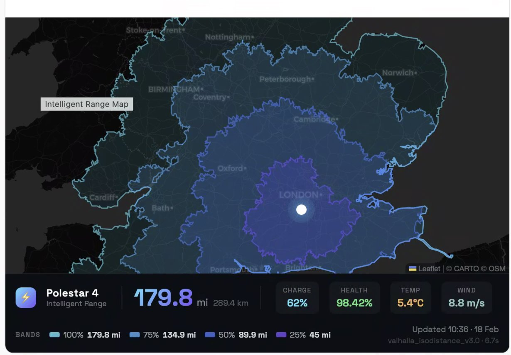

# Intelligent Range Map

A physics-based EV range visualisation system for Home Assistant that displays real-world reachable area as road-network polygons — not circles, actual roads you can drive.



## What it does

Calculates your EV's real-world range using a physics-based energy model factoring in:

- **Battery state** — current charge level (SoC) and health (SoH)
- **Weather** — temperature affects battery efficiency and HVAC load
- **Wind** — headwind increases aerodynamic drag
- **Mixed driving** — weighted model across city (35 km/h), suburban (60 km/h), and motorway (100 km/h)

Then renders **4 energy bands** (100%, 75%, 50%, 25%) as organic road-network polygons on a dark-themed Leaflet map, showing exactly where you can reach on real roads.

## Architecture

```
Home Assistant  →  Python script  →  Valhalla routing engine  →  Leaflet map
  (vehicle data)    (energy model)    (road-network polygons)    (visualisation)
```

- **Home Assistant** — reads vehicle telemetry (SoC, SoH, GPS, charging status)
- **OpenWeatherMap** — real-time temperature and wind data
- **Valhalla** — self-hosted open-source routing engine using OpenStreetMap data, generates isodistance polygons
- **Leaflet.js** — renders the map with CARTO dark basemap tiles

## Requirements

- **Home Assistant** (Container or OS) with your EV integration
- **Docker** — for running Valhalla
- **~4 GB disk space** — for OSM data and routing tiles
- **~2-3 GB RAM** — for the Valhalla container
- **OpenWeatherMap API key** (free tier)

## Quick Start

### 1. Set up Valhalla routing engine

Download OpenStreetMap data for your region (example: Great Britain):

```bash
mkdir -p ~/valhalla_data
cd ~/valhalla_data
curl -L -O https://download.geofabrik.de/europe/great-britain-latest.osm.pbf
```

Other regions available at [download.geofabrik.de](https://download.geofabrik.de/).

Start the Valhalla container:

```bash
docker run -dt --name valhalla \
  -p 8002:8002 \
  -m 16g \
  -e build_elevation=True \
  -v ~/valhalla_data:/custom_files \
  ghcr.io/valhalla/valhalla-scripted:latest
```

> **Note:** The first run builds routing tiles from OSM data. This takes 10-20 minutes depending on your machine and region size. If the build fails with an OOM kill during the "enhance" stage, see [Troubleshooting](#troubleshooting).

Increase the default distance limit:

```bash
docker exec valhalla python3 -c "
import json
with open('/custom_files/valhalla.json', 'r') as f:
    config = json.load(f)
config['service_limits']['isochrone']['max_distance_contour'] = 500
config['service_limits']['isochrone']['max_distance'] = 1000.0
with open('/custom_files/valhalla.json', 'w') as f:
    json.dump(config, f, indent=2)
print('Config updated')
"
docker restart valhalla
```

Ensure Valhalla auto-starts:

```bash
docker update --restart unless-stopped valhalla
```

### 2. Install the range calculator

Copy files into your Home Assistant config:

```bash
# Create directories
mkdir -p /config/scripts/ev_range
mkdir -p /config/www/ev_range

# Copy files
cp scripts/ev_range_calculator.py /config/scripts/ev_range/
cp scripts/requirements.txt /config/scripts/ev_range/
cp www/range_map.html /config/www/ev_range/

# Install dependencies
pip install -r /config/scripts/ev_range/requirements.txt
```

### 3. Configure environment

```bash
cp scripts/.env.example /config/scripts/ev_range/.env
# Edit with your values:
nano /config/scripts/ev_range/.env
```

### 4. Configure Home Assistant

Add the contents of `homeassistant_config.yaml` to your `configuration.yaml` and `automations.yaml`.

### 5. Add to dashboard

Add an iframe card to your HA dashboard:

```yaml
type: iframe
url: /local/ev_range/range_map.html
aspect_ratio: '4:3'
```

### 6. Test

```bash
docker exec homeassistant python3 /config/scripts/ev_range/ev_range_calculator.py
```

## Customisation

### Vehicle parameters

Edit the constants in `ev_range_calculator.py` to match your vehicle:

```python
BATTERY_CAPACITY_KWH = 100.0    # Usable battery capacity
VEHICLE_MASS_KG = 2435.0        # Kerb weight
DRAG_COEFFICIENT = 0.28         # Cd
FRONTAL_AREA_M2 = 2.62          # Frontal area
```

### Entity IDs

Update the `ha_get_state()` calls in `get_vehicle_state()` to match your vehicle's entity IDs in Home Assistant.

### Colours and bands

Edit the `ENERGY_BANDS` list to change colours, labels, or add/remove bands.

## Troubleshooting

### Valhalla build fails with OOM during "enhance" stage

The enhance stage is memory-intensive with 10 threads. Override the entrypoint and run manually with fewer threads:

```bash
docker rm -f valhalla
docker run -dt --name valhalla -p 8002:8002 -m 16g \
  -v ~/valhalla_data:/custom_files \
  --entrypoint /bin/bash \
  ghcr.io/valhalla/valhalla-scripted:latest

# Run enhance with 2 threads
docker exec -it valhalla valhalla_build_tiles \
  -c /custom_files/valhalla.json \
  -s enhance -e cleanup -j 2 \
  /custom_files/great-britain-latest.osm.pbf

# Tar the tiles
docker exec valhalla tar cf /custom_files/valhalla_tiles.tar \
  -C /custom_files/valhalla_tiles .

# Restart normally
docker rm -f valhalla
docker run -dt --name valhalla -p 8002:8002 \
  -e use_tiles_ignore_pbf=True -e serve_tiles=True \
  -v ~/valhalla_data:/custom_files \
  ghcr.io/valhalla/valhalla-scripted:latest
```

### "Exceeded max distance" error

Update the Valhalla config to allow larger isodistance queries — see step 1 above.

### "No suitable edges near location"

The routing tiles weren't fully built. Delete `valhalla_tiles.tar` and `valhalla_tiles/` directory, then rebuild.

## How it works

### Energy model

The physics-based model calculates energy consumption per kilometre:

1. **Aerodynamic drag** — `F = 0.5 × ρ × Cd × A × v²` (includes wind)
2. **Rolling resistance** — `F = Crr × m × g`
3. **Gradient** — elevation changes with regenerative braking recovery
4. **HVAC** — temperature-dependent heating/cooling load
5. **Auxiliaries** — base electrical load (lights, electronics)

Consumption is calculated at three speeds (city/suburban/motorway) and weighted 40/40/20.

### Routing

Valhalla's isodistance API generates polygons representing the area reachable within a given driving distance, following actual road networks. This means the range extends further along motorways and contracts around areas with only slow local roads — exactly how real-world EV range works.

## Stack

| Component | Purpose |
|-----------|---------|
| [Home Assistant](https://www.home-assistant.io/) | Vehicle telemetry & dashboard |
| [Valhalla](https://github.com/valhalla/valhalla) | Self-hosted routing engine |
| [OpenStreetMap](https://www.openstreetmap.org/) | Road network data |
| [Leaflet.js](https://leafletjs.com/) | Map visualisation |
| [OpenWeatherMap](https://openweathermap.org/) | Real-time weather data |
| [CARTO](https://carto.com/) | Dark basemap tiles |

## Cost

**Zero.** No API subscriptions, no monthly fees. Everything runs locally.

## Credits

Built with [Claude](https://claude.ai) as an AI coding partner.

## License

MIT — see [LICENSE](LICENSE).
